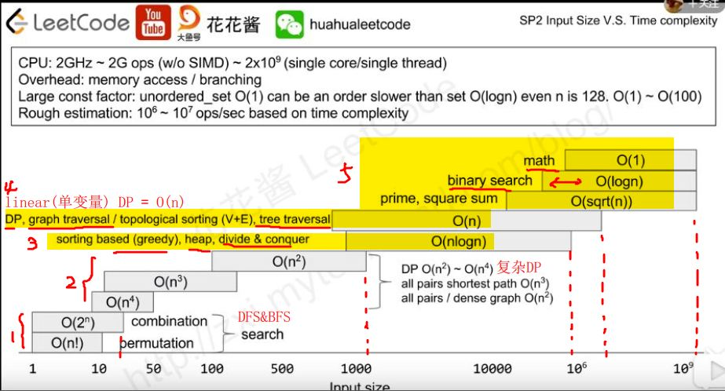

1. 数据量小(0~20)时：
    * 常见搜索算法DFS,BFS；这些算法的复杂度是O(n!),O(2^N)
2. 数据量大(20~10^6)时：
    * Tree Traversal, graph Traversal;
    * Heap Based;
    * sorting based;
    * 常见DP算法(包括linear DP & other DPs), greedy policy, divide & conquer policy
3. 数据量极大时：
    * Binary Search
    * Math answer

* 例题1、
  * 一年的全国高考考生人数为500 万，分数使用标准分，最低100 ，最高900 ，没有小数，你把这500 万元素的数组排个序。
        对500W数据排序，如果基于比较的先进排序，平均比较次数为O(5000000*log5000000)≈1.112亿。但是我们发现，这些数据都有特殊的条件：  100=<score<=900。那么我们就可以考虑桶排序这样一个“投机取巧”的办法、让其在毫秒级别就完成500万排序。
       创建801(900-100)个桶。将每个考生的分数丢进f(score)=score-100的桶中。这个过程从头到尾遍历一遍数据只需要500W次。然后根据桶号大小依次将桶中数值输出，即可以得到一个有序的序列。而且可以很容易的得到100分有xxx人，501分有xxx人。
      实际上，桶排序对数据的条件有特殊要求，如果上面的分数不是从100-900，而是从0-2亿，那么分配2亿个桶显然是不可能的。所以桶排序有其局限性，适合元素值集合并不大的情况。
* 例题2、
  * 在一个文件中有 10G 个整数，乱序排列，要求找出中位数。内存限制为 2G。只写出思路即可（内存限制为 2G的意思就是，可以使用2G的空间来运行程序，而不考虑这台机器上的其他软件的占用内存）。
    * 分析： 既然要找中位数，很简单就是排序的想法。那么基于字节的桶排序是一个可行的方法。
    * 思想：将整型的每1byte作为一个关键字，也就是说一个整形可以拆成4个keys，而且最高位的keys越大，整数越大。如果高位keys相同，则比较次高位的keys。整个比较过程类似于字符串的字典序。按以下步骤实施：
    * 1、把10G整数每2G读入一次内存，然后一次遍历这536,870,912即（1024*1024*1024）*2 /4个数据。每个数据用位运算">>"取出最高8位(31-24)。这8bits(0-255)最多表示255个桶，那么可以根据8bit的值来确定丢入第几个桶。最后把每个桶写入一个磁盘文件中，同时在内存中统计每个桶内数据的数量，自然这个数量只需要255个整形空间即可。
    * 2、继续以内存中的整数的次高8bit进行桶排序(23-16)。过程和第一步相同，也是255个桶。
    * 3、一直下去，直到最低字节(7-0bit)的桶排序结束。我相信这个时候完全可以在内存中使用一次快排就可以了。
* 例题3、
  * 给定n个实数x1,x2,...,xn,求这n个实数在实轴上相邻2个数之间的最大差值M,要求设计线性的时间算法
    * 典型的最大间隙问题。要求线性时间算法。需要使用桶排序。桶排序的平均时间复发度是O(N).如果桶排序的数据分布不均匀，假设都分配到同一个桶中，最坏情况下的时间复杂度将变为O(N^2).
    * 桶排序: 最关键的建桶，如果桶设计得不好的话桶排序是几乎没有作用的。通常情况下，上下界有两种取法，第一种是取一个10^n或者是2^n的数，方便实现。另一种是取数列的最大值和最小值然后均分作桶。
      对于这个题，最关键的一步是：由抽屉原理知：最大差值M>= (Max(V[n])-Min(V[n]))/(n-1)！所以，假如以(Max(V[n])-Min(V[n]))/(n-1)为桶宽的话，答案一定不是属于同一个桶的两元素之差。因此，这样建桶，每次只保留桶里面的最大值和最小值即可。
